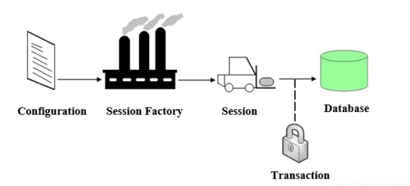

one to one:
each one has a field from the other table that not appear in the tables
there is join column in one of the one's which appear in that table
and the other mappes to that join column

one to many, many to one:
in one we have a list of many table which will not appear in the table
in many we have a field from the one table not appear in the table
in many we will have a join column which will appear in the table

many to many:
makes a join table consisting one foreign key from each table

Users: 
one to many to Orders
many to many to Address

Orders:
many to one to User
many to one to Address
ont to many to OrderItem

OrderItem:
many to one to Orders
one to one to Product

Product:
one to one to OrderItem
many to one to Category

Category:
one to many to OrderItem

# Revagenda
So we have three layers
1 - Persistent : repositories
2 - service
3 - api(servlets) : controllers

Spring Annotations
Spring Config
@Configuration - marks a class as the bean configuration class which has methods that
return objects to be beanified.

@ComponentScan - tells IoC container to configure by scanning for annotated components

@Bean - marks a class as a bean (not for component scanning!)

@Component - marks a class as a component (a bean) for component scanning. There are
also the "stereotype" annotations below:
@Repository - marks as a JPA repository bean
@Service - marks as a service bean
@Controller - marks as a controller (servlet) bean

@Autowired - injects dependencies from IoC contrainer automagically
This searches the dependencies by type

@Resource - alternative to @Autowired, this injects beans into fields or setters. 
Not constructors! based on names. if multiple fileds from one type exists in the class

@Qualifier - In addition to byName and byType you can find beans by qualifier.
The @Qualifier annotation specifies a particular @Autowired-annotated bean based on the bean's
identifier (the bean name). As such, the @Qualifier annotation is a Spring annotation.
so instead of saying @Autowired you would say @qualifier("name of the bean that you want to 
search for). if you say @Component("name of the whole class or the bean") then with @qualifier
you can search by that name instead of the type of the dependency object

@Inject - alternative to @Autowired, this injects beans into fields or setters. 
Not constructors!

@Required - indicates the annotated bean field is required and a bean cannot be instantiated
if it is not supplied.

@Inject - Another way to inject dependencies from IoC container
java also provides standard annotations which can be used to inject object dependencies. 
These annotations, @Inject require the use of the javax.inject package. Similarly to 
@Autowired, @Inject can occur at the class, field and constructor argument levels, 
based on the bean type.

@Named - Allows @Inject to find beans byName instead of byType
Java also provides standard annotations which can be used to inject object dependencies. 
These annotations @Named require the use of the javax.inject package.
The @Named annotation can serve the same purpose as the @Qualifier annotation to 
disambiguate between bean definitions, and additionally be used as a bean definition 
equivalent to the @Component annotation.

Spring MVC (Web)
@Controller - stereotype annotation that marks class as a controller 
(basically a servlet)

@Restcontroller - Implies @Controller and @ResponseBody

@PathVariable - marks a parameter in a controller method to be populated by the correpsonding

path variable

@RequestMapping - maps a controller or method to a URL pattern

@GetMapping - @RequestMapping that denotes the GET method

@PostMapping - @RequestMapping that denotes the POST method

@PutMapping - @RequestMapping that denotes the PUT method

@DeleteMapping - @RequestMapping that denotes the DELETE method

@RequestBody - Marks a parameter as a request payload that should be de-serialized from JSON/XML

@ResponseBody - This annotation marks a return type to be serialized into JSON/XML 
payload

@ResponseStatus - Use this annotation to set the response status for a successful method

@RequestParam - Marks a parameter in a controller method to be populated with the value

associated with a key in the request payload

@RequestHeader - marks a parameter in a controller method to be populated with the value
associated with a key in the request headers

Transmitting Data
There are a number of ways to transmit data as part of these requests and responses:

1-Path variables(@PathVariable) and a query parameter
www.bank.com/api/user/{3}/account/{5}/transaction/{2022-05-08}?type=deposit

2-lots of query parameters
www.bank.com/api/transactions?user=3&account=5&transaction=2022-05-08&type=deposit

3-headers

www.bank.com/api/transactions
headers:
user=3
account=5
transaction=2022...
type=deposit

4-JSON body

www.bank.com/api/transactions
body:
{
"user" : 3
"account" : 5
"transaction" : "2022-05-08"
"type" : "deposit"
}
What we want to do is probably a mix of all 4:

Path parameters for resource pathing through a restful hierarchy of resources
query params for anything else that has to do with the content of the request
headers for anything that has to do with the request itself, not the contents (request metadata)
JSON body for anything that is a resource representation

Create:Post
Read:Get
Update:Put
Delete:Delete

Hibernate annotations used in the above class are listed below:

@Entity - Used to mark a class as a Mapped class/Persistence class. This class must
have a no-arg constructor with package visibility so that hibernate can create an instance
of the Persistent class by the newInstance() method.

@Table - Used to specify the table details that used to persist the entity in the database.
If the name of the database table differs from the name of the class, the name attribute
should be used.

@Id - Used to mark the field as a primary key column. Annotating multiple fields with
@Id will make them composite keys

@GeneratedValue - Used to instruct the database to generate a value for the field automatically,
and to provide a strategy for doing so.

@Column - Maps the field to the table column. The @Column annotation has attributes listed below:

name - used to specify the name of the column. By default, it's assumed the column name and
variable name match. This attribute is required if that is not the case.
length - used to specify the size of the String value
nullable - used to mark the column as NOT NULL when the schema is generated.
unique - used to mark the column as UNIQUE to contain unique values.

# Revagenda

https://www.java2novice.com/hibernate/

SessionFactory can be created by providing Configuration object, which will contain all DB
related property details pulled from either hibernate.cfg.xml file or hibernate.properties file.
SessionFactory is a factory for Session objects.

We can create one SessionFactory implementation per database in any application.
If your application is referring to multiple databases, then you need to create one
SessionFactory per database.

Unlike SessionFactory, the Session object will be created on demand. Session is a
lightweight object. Session provides a physical connectivity between your application
and database. The Session will be established each time your application wants to do
something with database. Session object will be provided by SessionFactory object.
All the persistent objects will be saved and retrieved through Session object.
The session object must be destroyed after using it.

The lifecycle of a Session is bounded by the beginning and end of a logical transaction.
The main function of the Session is to offer create, read and delete operations for instances
of mapped entity classes. Instances may exist in one of three states:

transient: never persistent, not associated with any Session.
persistent: associated with a unique Session.
detached: previously persistent, not associated with any Session.

List Hibernate Session interface methods:
beginTransaction()
Begin a unit of work and return the associated Transaction object. This method needs to be called if
you want to enable transaction, and once your DB interactions are done, call commit() method on
the returned transaction object. In case of any issues, call rollback() error on the transaction object.

save()
Persist the given transient instance, first assigning a generated identifier.
This method stores the given object in the database. Before storing, it checks
for generated identifier declaration and process it first, then it will store into DB.

update()
Update the persistent instance with the identifier of the given detached instance.
It updates the database record.

saveOrUpdate()
Either save(Object) or update(Object) the given instance, depending upon resolution
of the unsaved-value checks. This operation cascades to associated instances if the
association is mapped with cascade="save-update".

createQuery()
Create a new instance of Query for the given HQL query string.

createSQLQuery()
Create a new instance of SQLQuery for the given SQL query string.

merge()
Copy the state of the given object onto the persistent object with the same identifier.
If there is no persistent instance currently associated with the session, it will be loaded.
Return the persistent instance. If the given instance is unsaved, save a copy of and return
it as a newly persistent instance. The given instance does not become associated with the session.
This operation cascades to associated instances if the association is mapped with cascade="merge".

persist()
Make a transient instance persistent. This operation cascades to associated instances if
the association is mapped with cascade="persist".

flush()
Force this session to flush. Must be called at the end of a unit of work, before committing
the transaction and closing the session. Flushing is the process of synchronizing the underlying
persistent store with persistable state held in memory.

delete()
Remove a persistent instance from the datastore. The argument may be an instance associated with
the receiving Session or a transient instance with an identifier associated with existing persistent
state. This operation cascades to associated instances if the association is mapped with
cascade="delete".

What is Hibernate Query object?

The Hibernate Query object is used to retrieve data from database. You can use either SQL or
Hibernate Query Language (HQL). A Query instance is obtained by calling Session.createQuery().

The Query object is used to bind query parameters, limit query results and execute the query.

Here is the list of Query methods which will be used very often in Hibernate implementations:

list()
Return the query results as a List. If the query contains multiple results pre row,
the results are returned in an instance of Object[].

executeUpdate()
Execute the update or delete statement. It returns the number of entities updated or deleted.

setParameter()
Bind a value to a JDBC-style query parameter. The Hibernate type of the parameter is first
detected via the usage/position in the query and if not sufficient secondly guessed from the
class of the given object.

uniqueResult()
Convenience method to return a single instance that matches the query, or null if the query
returns no results.

setMaxResults()
Set the maximum number of rows to retrieve. If not set, there is no limit to the number of rows
retrieved.

setFirstResult()
Set the first row to retrieve. If not set, rows will be retrieved beginning from row 0.

Spring Data Annotations
Spring Data abstracts away the code required for data storage solutions, allowing us to focus more on the business logic. The following is a list and brief explanation of some common Spring Data annotations which allow us to configure how the queries are executed.

Annotation	Purpose
@Transactional	Configure how the database transaction behaves. See the @Transactional notes.
@NoRepositoryBean	Creates and interface that provides common methods for child repositories
@Param	Parameters can be passed to queries defined with @Query
@Id	Marks a field in a model class as the primary key
@Transient	Mark a field as transient, to be ignored by the data store engine during reads and writes
@CreatedBy, @LastModifiedBy	Auditing annotations that will automatically filled with the current principal
@CreatedDate, @LastModifiedDate	Auditing annotations that will automatically fill with current date
@Query	Supply a JPQL query for repository methods

scope of the beans:
Please read the spring from YouTube Telusko
As a general rule, the prototype scope should be used for stateful beans,
while the singleton scope should be used for stateless beans.
To change the default(Singleton):
@Component
@Scope(value="prototype")
